<!-- PROJECT LOGO -->
<br />
<div align="center">

<h3 align="center">BudgetFlix Worker</h3>

  <p align="center">
    Lightweight media processing daemon built for the BudgetFlix ecosystem.
    <br />
    Queue-driven. Minimal. Fast.
    <br />
    <br />
    <a href="https://github.com/BudgetFlix/worker">View Repository</a>
    ·
    <a href="https://github.com/BudgetFlix/worker/issues">Report Bug</a>
    ·
    <a href="https://github.com/BudgetFlix/worker/issues">Request Feature</a>
  </p>
</div>

---

<!-- TABLE OF CONTENTS -->
<details>
  <summary>📚 Table of Contents</summary>

  <ol>
    <li>
      <a href="#about-the-project">About The Project</a>
    </li>
    <li>
      <a href="#architecture">Architecture</a>
    </li>
    <li>
      <a href="#worker-flow">Worker Flow</a>
    </li>
    <li>
      <a href="#built-with">Built With</a>
    </li>
    <li>
      <a href="#getting-started">Getting Started</a>
    </li>
    <li>
      <a href="#deployment">Deployment</a>
    </li>
    <li>
      <a href="#roadmap">Roadmap</a>
    </li>
    <li>
      <a href="#design-philosophy">Design Philosophy</a>
    </li>
  </ol>

</details>

---

# About The Project

BudgetFlix Worker is a lightweight daemon written in Go, designed to process asynchronous media jobs inside the BudgetFlix ecosystem.

The worker operates as a long-running service that consumes tasks from RabbitMQ and processes media pipelines using FFmpeg.

Current responsibilities include:

- RabbitMQ job consumption
- Background daemon processing
- FFmpeg media processing
- Status-based file movement
- Queue-driven workflows
- Automated job lifecycle handling

The worker is intentionally designed to stay lightweight and operationally simple.

Rather than focusing on high-complexity orchestration, the system prioritizes:

- Reliability
- Simplicity
- Low resource usage
- Easy deployment
- Maintainability

---

# Architecture

```mermaid
flowchart TD

    PRODUCER[Media Service / API]
    MQ[RabbitMQ]
    WORKER[BudgetFlix Worker]
    FFMPEG[FFmpeg Processing]
    STORAGE[Job UUID Directories]

    PRODUCER --> MQ
    MQ --> WORKER
    WORKER --> FFMPEG
    FFMPEG --> STORAGE
````

---

# Worker Flow

Each media job follows a status-based processing lifecycle.

```mermaid
flowchart LR

    CREATED[job_UUID_created]
    QUEUED[job_UUID_queued]
    PROCESSING[job_UUID_processing]
    COMPLETED[job_UUID_completed]
    FAILED[job_UUID_failed]

    CREATED --> QUEUED
    QUEUED --> PROCESSING
    PROCESSING --> COMPLETED
    PROCESSING --> FAILED
```

The worker monitors incoming jobs and moves them through processing states based on execution results.

This architecture keeps the pipeline transparent and easy to debug.

---

# Built With

<div align="left">


</div>

---

# Getting Started

## Prerequisites

Before starting, make sure you have:

* Go
* Docker
* RabbitMQ
* FFmpeg

---

## Installation

Clone the repository:

```bash id="2f1o4q"
git clone https://github.com/BudgetFlix/worker.git
```

Enter the project directory:

```bash id="0i4rj3"
cd worker
```

Run the worker:

```bash id="m7xt9w"
go run .
```

---

# Deployment

The worker is deployed using containerized infrastructure.

Whenever changes are pushed to the `main` branch:

1. GitHub Actions builds the worker image
2. The Docker image is pushed to the package registry
3. Remote infrastructure pulls the latest image
4. Docker Compose updates the running worker

---

## Deployment Pipeline

```mermaid
flowchart LR

    CODE[Code Changes]
    PUSH[Push To Main]
    ACTIONS[GitHub Actions]
    BUILD[Build Docker Image]
    REGISTRY[Container Registry]
    SERVER[Remote Server]
    COMPOSE[Docker Compose]
    WORKER[Updated Worker]

    CODE --> PUSH
    PUSH --> ACTIONS
    ACTIONS --> BUILD
    BUILD --> REGISTRY
    REGISTRY --> SERVER
    SERVER --> COMPOSE
    COMPOSE --> WORKER
```



---

# Roadmap

* [x] Initial Go worker
* [x] RabbitMQ consumer
* [x] Docker deployment
* [ ] FFmpeg integration
* [ ] Job status pipeline
* [ ] Structured logging
* [ ] Retry handling
* [ ] Worker health checks
* [ ] Metrics & monitoring
* [ ] Multi-job scheduling
* [ ] Better error handling
* [ ] Remote configuration support

---

# Design Philosophy

The worker is intentionally designed as a minimal daemon process.

Key principles:

* Lightweight runtime
* Minimal abstractions
* Queue-first architecture
* Operational simplicity
* Predictable behavior
* Easy debugging
* Infrastructure-friendly deployment

The goal is not to build a massive orchestration framework, but rather a focused and reliable media worker that can run continuously with minimal overhead.

---

<div align="center">

Built for long-running media automation ⚙️

</div>
