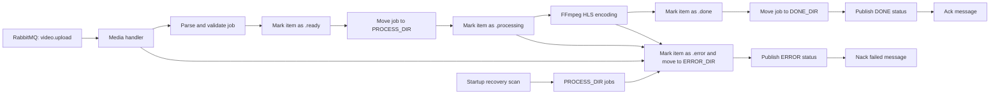

# BudgetFlix Worker

**Lightweight Go worker service** for the BudgetFlix backend. It consumes media upload jobs from **RabbitMQ**, validates the incoming job folder, converts movie files to **HLS with FFmpeg**, and moves job folders through a **filesystem-based lifecycle**.

## What It Does

- Consumes messages from the `video.upload` RabbitMQ queue by default
- Parses and validates media job payloads
- Processes `MOVIE` jobs with exactly one video item
- Sends status messages to the API layer through `video.upload.retry`
- Converts the source video into HLS output:
  - `index.m3u8`
  - `seg_000.ts`, `seg_001.ts`, ...
- Writes movie HLS output under the configured movie library directory
- Cleans previous HLS playlist and segment files before encoding
- Tracks file state with suffixes:
  - original file
  - `.ready`
  - `.processing`
  - `.done`
  - `.error`
- Moves job folders between configured state directories
- On startup, moves interrupted jobs from `PROCESS_DIR` to `ERROR_DIR`
- Acknowledges successful RabbitMQ messages and negatively acknowledges failed ones
- Waits for active pipelines during graceful shutdown

## Tech Stack


## Project Structure

```text
.
+-- main.go                    # Worker entrypoint and graceful shutdown
+-- Dockerfile                 # Multi-stage build with FFmpeg runtime image
+-- internal
|   +-- config                 # Environment configuration
|   +-- ffmpeg                 # HLS command builder and runner
|   +-- handler                # RabbitMQ message handler
|   +-- job                    # Job parsing, validation and models
|   +-- logger                 # Logging helpers
|   +-- pipeline               # Media processing pipelines
|   +-- rabbitmq               # Connection, consumer, ack/nack loop
|   +-- storage                # File state and directory movement helpers
+-- README.md
```

## Worker Flow



## Job Message Format

The worker expects JSON messages with this shape:

```json
{
  "jobID": "example-job-id",
  "mediaID": 123,
  "type": "MOVIE",
  "path": "optional/source/path/from-producer",
  "videos": {
    "0": "/path/to/video.mp4"
  }
}
```

Notes:

- `type` currently supports `MOVIE` in the implemented pipeline.
- `MOVIE` jobs must contain exactly one video item.
- The worker first looks for the job directory at `NEW_DIR/job_<jobID>`.
- If the job directory is not in `NEW_DIR`, the worker looks at `ERROR_DIR/job_<jobID>` for manual retry handling.
- The `path` field exists in the message shape, but the worker does not use it yet.
- Video file names are taken from the submitted video paths and resolved inside the job directory.

## Status Message Format

After every handled job, the worker publishes a status message to `video.upload.retry`.

Successful job:

```json
{
  "id": "example-job-id",
  "status": "DONE"
}
```

Failed job:

```json
{
  "id": "example-job-id",
  "status": "ERROR",
  "errorMsg": "error details"
}
```

The API layer is expected to update the database from this status message. Manual retry is started from the API/dashboard layer.

## File Lifecycle

For a job with ID `abc123`, the worker expects the upload folder to exist at:

```text
NEW_DIR/job_abc123
```

During processing, the job directory and file states move through:

```text
NEW_DIR/job_abc123
PROCESS_DIR/job_abc123
DONE_DIR/job_abc123
```

On failure, the job is moved to:

```text
ERROR_DIR/job_abc123
```

The video file itself is renamed as it advances:

```text
movie.mp4
movie.mp4.ready
movie.mp4.processing
movie.mp4.done
```

If processing fails, the worker marks the item as `.error` and moves the job folder to `ERROR_DIR`:

```text
movie.mp4.error
```

On startup, the worker scans `PROCESS_DIR`. Any job folder left there is treated as interrupted work, all files are marked with `.error`, and the folder is moved to `ERROR_DIR`. This keeps manual retry centralized in the API/dashboard flow.

## HLS Output

For movie jobs, output is created at:

```text
MOVIE_SOURCE/<mediaID>/hls
```

The FFmpeg command uses:

- overwrite mode (`-y`)
- H.264 video (`libx264`)
- AAC audio
- HLS VOD playlist
- 6 second HLS segments
- `index.m3u8` as the playlist file
- `seg_%03d.ts` as the segment pattern

Before encoding, the worker removes previous `index.m3u8` and `seg_*.ts` files from the target HLS directory so manual retries do not leave stale HLS segments behind.

## Configuration

Configuration is read from environment variables. Missing variables fall back to local defaults.

| Variable | Default | Description |
| --- | --- | --- |
| `RABBITMQ_HOST` | `localhost` | RabbitMQ host |
| `RABBITMQ_PORT` | `5672` | RabbitMQ port |
| `RABBITMQ_USERNAME` | `guest` | RabbitMQ username |
| `RABBITMQ_PASSWORD` | `guest` | RabbitMQ password |
| `VIDEO_UPLOAD_QUEUE` | `video.upload` | Queue consumed by the worker |
| `VIDEO_UPLOAD_RETRY_QUEUE` | `video.upload.retry` | Queue where `DONE` and `ERROR` status messages are published |
| `NEW_DIR` | `/tmp/new` | Directory where new job folders are expected |
| `PROCESS_DIR` | `/tmp/process` | Directory for active jobs |
| `DONE_DIR` | `/tmp/done` | Directory for completed jobs |
| `ERROR_DIR` | `/tmp/error` | Directory for failed jobs |
| `ERROR_LOG` | `/tmp/error/error.log` | Error log path placeholder |
| `MOVIE_SOURCE` | `/tmp/movies` | Movie library root |
| `SERIES_SOURCE` | `/tmp/series` | Series library root |

The RabbitMQ connection URL is built as:

```text
amqp://<RABBITMQ_USERNAME>:<RABBITMQ_PASSWORD>@<RABBITMQ_HOST>:<RABBITMQ_PORT>/
```

## Running Locally

Prerequisites:

- Go `1.24.3`
- RabbitMQ
- FFmpeg available on `PATH`

Run the worker:

```bash
go run .
```

Run tests:

```bash
go test ./...
```

Example local environment:

```bash
export RABBITMQ_HOST=localhost
export RABBITMQ_PORT=5672
export RABBITMQ_USERNAME=guest
export RABBITMQ_PASSWORD=guest
export NEW_DIR=/tmp/new
export PROCESS_DIR=/tmp/process
export DONE_DIR=/tmp/done
export ERROR_DIR=/tmp/error
export MOVIE_SOURCE=/tmp/movies
```

## Docker

Build the image:

```bash
docker build -t budgetflix-worker .
```

Run the container:

```bash
docker run --rm \
  -e RABBITMQ_HOST=host.docker.internal \
  -e RABBITMQ_PORT=5672 \
  -e RABBITMQ_USERNAME=guest \
  -e RABBITMQ_PASSWORD=guest \
  -v /tmp/new:/tmp/new \
  -v /tmp/process:/tmp/process \
  -v /tmp/done:/tmp/done \
  -v /tmp/error:/tmp/error \
  -v /tmp/movies:/tmp/movies \
  budgetflix-worker
```

The Dockerfile builds a static Go binary in a Go Alpine builder image and runs it in an FFmpeg-enabled runtime image.

## RabbitMQ Behavior

- Consumed queue: `VIDEO_UPLOAD_QUEUE`
- Status queue: `VIDEO_UPLOAD_RETRY_QUEUE`
- Manual acknowledgements are used.
- QoS prefetch is set to `1`, so the worker processes one message at a time per consumer.
- Successful jobs publish `DONE`, then the original message is acknowledged with `Ack`.
- Failed jobs publish `ERROR`, then the original message is rejected with `Nack` and `requeue=false`.
- Automatic retry is not performed by the worker. Retry is expected to be started manually from the API/dashboard layer.

## Graceful Shutdown

The worker listens for interrupt and `SIGTERM` signals. On shutdown it:

1. Stops the consumer loop.
2. Waits for active pipelines to finish.
3. Exits after all pipelines complete or after a 3 minute timeout.

## Current Limitations

- Only the `MOVIE` pipeline is implemented.
- `SHOW` is defined as a media type but is not processed yet.
- Movie jobs must contain exactly one video file.
- Retry is manual and controlled by the API/dashboard layer.
- Metrics and health checks are not implemented yet.
- The worker currently derives job folders from `NEW_DIR` and `ERROR_DIR`; future versions should resolve the folder from the message payload.

## Development Notes

Useful commands:

```bash
go test ./...
go run .
go build -o worker .
```

Before changing processing behavior, check these areas:

- `internal/job` for message format and validation
- `internal/storage` for job movement and file state changes
- `internal/pipeline` for media-specific processing
- `internal/ffmpeg` for HLS command generation
- `internal/rabbitmq` for queue consumption behavior
